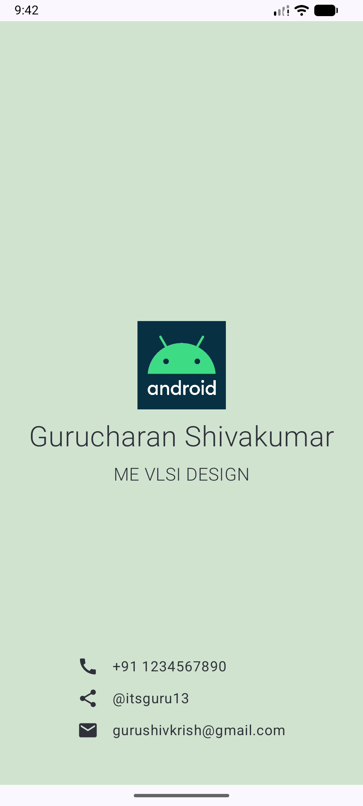

# Business Card

A simple digital business card app I built to learn Jetpack Compose and Material 3. It shows my name, designation, and contact info in a clean layout.

## What I learned

- Compose layouts with `Column`, `Row`, `Image`, `Text`, `Icon`
- Material 3 theming and dynamic colors
- Edge-to-edge display setup
- Structuring a basic Android app with Compose

## Preview

## Notes

- Min SDK 24, target SDK 37
- Uses Compose BOM 2026.02.01
- Built with Kotlin 2.2.10 and AGP 9.2.1

