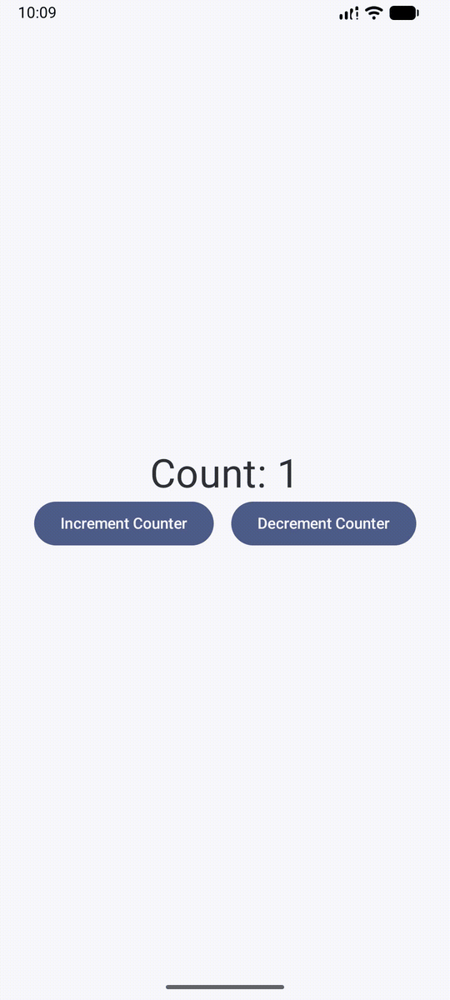

# Counter App

A simple counter app I built to wrap my head around how the view layer and its model work together in Jetpack Compose. You press buttons, the number goes up and down. Simple.

## What I learned

- `CounterViewModel` holds the state using `StateFlow` and exposes it as immutable `StateFlow`
- `CounterScreen` observes the state via `collectAsStateWithLifecycle()` and passes it down to `CounterContent`
- `CounterContent` is a stateless composable that just receives count and callbacks — the view is just a pure function of state
- How the ViewModel survives configuration changes and the UI stays in sync

## Preview

## Notes

- Min SDK 24, target SDK 37
- Uses Compose BOM 2026.02.01
- Built with Kotlin 2.2.10 and AGP 9.2.1
